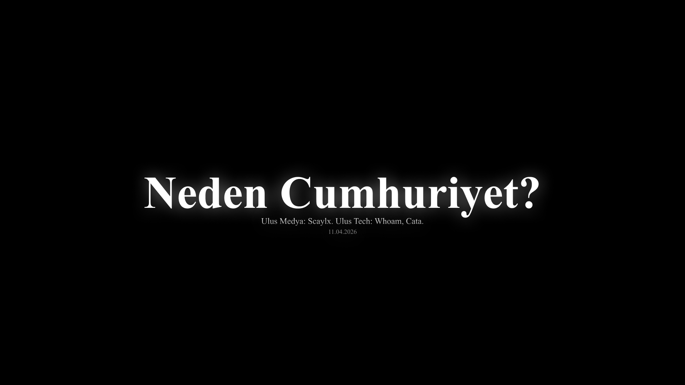

# Video Yönetmeliği

Ulus altında üretilen video içerikleri belli bir format izlemeli.

## Giriş Sekansı

Intro veya Intro Sequence olarakta bilnen giriş sekanslarında sert bir format vardır.

Her video bir başlık, yapan kişiler ve tarih bilgisi barındırır.

Başlık her kelimenin ilk harfi büyük olacak şekilde, diğer tüm yazılardan büyük yazılır.

Video üstünde çalışmış kişiler çalıştıkları ekip, deparman veya kurum belirtilmiş bir şekilde başlığın altına yazılır.
Başlığa kıyasla daha küçük, hatta şeffaflık gibi yollardan daha az görülebilir yazılır.

Times New Roman yazı tipi kullanılır.

**Örnek:**

